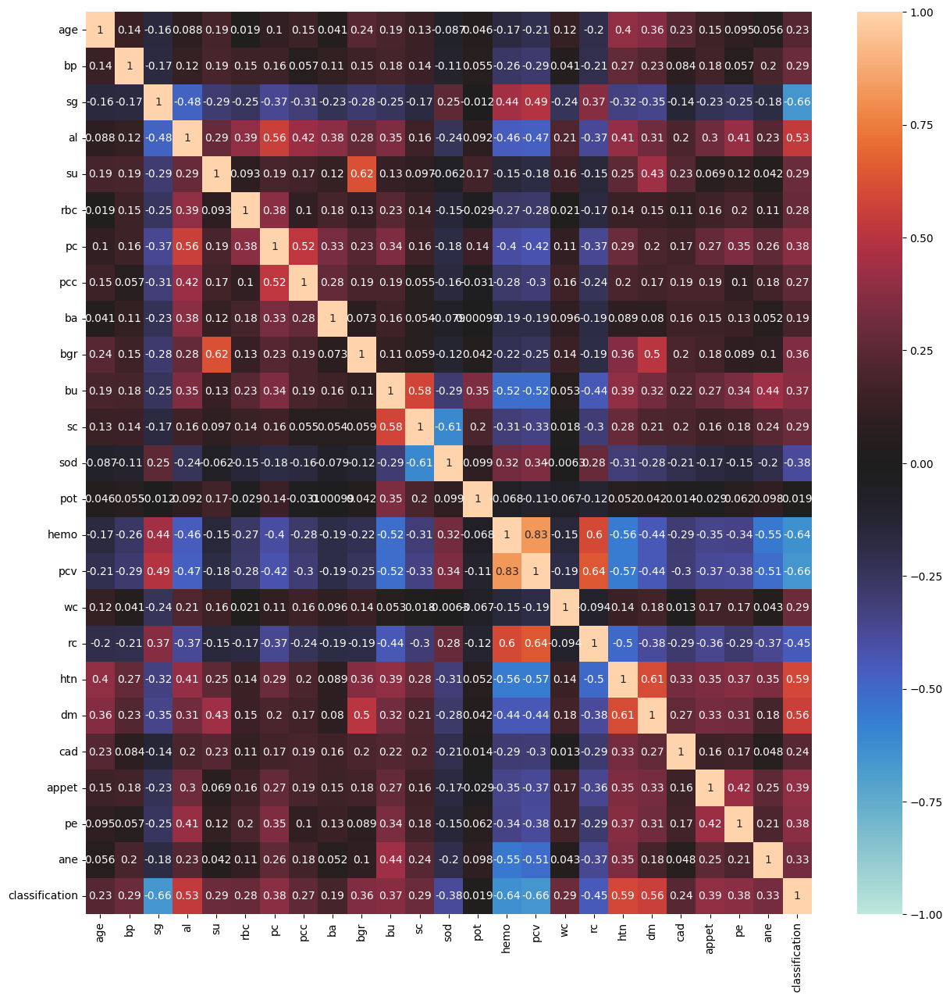
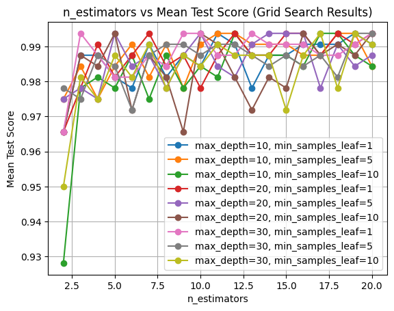
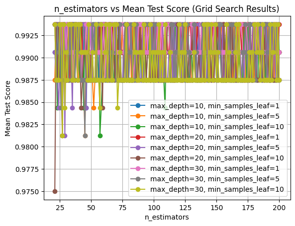
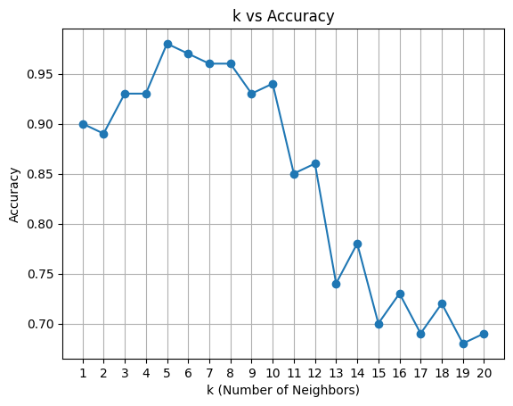
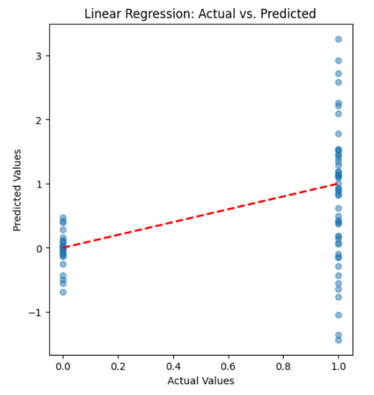
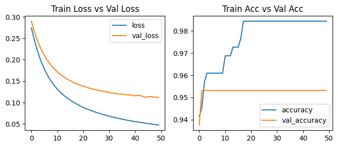

# Chronic Kidney Disease Prediction


Machine-learning project comparing classification models for chronic kidney disease prediction through data cleaning, model training, and performance evaluation.

> This project is an educational machine-learning study, not a medical device. Its predictions must not be used for diagnosis, treatment, or clinical decision-making.

## Technologies

- Python
- Jupyter Notebook
- Machine-learning classification
- Data preprocessing and model evaluation

## Models

- Random Forest
- Decision Tree
- Logistic Regression
- K-Nearest Neighbors
- Artificial Neural Network
- Lasso-related experiment *(confirm its exact role from the notebook)*
- Support Vector Machine *(include only if its implementation is found and tested)*

## Project Workflow

1. Load the chronic kidney disease dataset.
2. Inspect the data types, target values, and missing data.
3. Clean and transform the dataset for model training.
4. Separate features from the prediction target.
5. Split the data into training and testing sets or apply the documented validation procedure.
6. Train each classification model independently.
7. Evaluate the models using appropriate classification metrics.
8. Compare model performance and document the strongest-performing approach.

## Repository Contents

- `data/`: dataset used by the experiments
- `notebooks/`: cleaning, training, and evaluation experiments
- `src/`: supporting Python source
- `images/`: selected result plots or comparison figures
- `references/`: project-authored literature review

## Running the Project

1. Clone the repository.
2. Create and activate a Python virtual environment.
3. Install the confirmed dependencies:

   ```bash
   pip install -r requirements.txt
   ```

4. Start Jupyter:

   ```bash
   jupyter notebook
   ```

5. Run the data-cleaning notebook first.
6. Run each model notebook in the documented order.

## Evaluation

Report:

- Test or cross-validation accuracy
- Precision
- Recall
- F1-score
- Confusion matrix
- Class distribution
- Validation method

## Results

| Model | Accuracy | Precision | Recall | F1-score |
| --- | ---: | ---: | ---: | ---: |
| Decision Tree | 98.75% | 1.0000 | 0.9875 | 0.9936 |
| Random Forest | 99.375% | 1.0000 | 1.0000 | 1.0000 |
| Logistic Regression | 93.75% | 0.9375 | 0.9375 | 0.9375 |
| K-Nearest Neighbors(N=5) | 98.00% | To verify | To verify | To verify |
| Artificial Neural Network | 99.00% | 0.9869 | 0.9899 | 0.9963 |
| SVM, polynomial degree 2 | 97.00% | 0.9696 | 0.9846 | 0.9770 |

## What I Learned

- How to clean health-related tabular data for classification
- How to train and compare multiple machine-learning models
- How preprocessing choices affect different algorithms
- How to evaluate classifiers beyond accuracy alone
- How to organize separate model experiments in Jupyter notebooks
- Why very high model performance requires careful checks for leakage, imbalance, and validation design

## Possible Improvements

- Consolidate repeated preprocessing into a reusable pipeline
- Use stratified train/test splits or stratified cross-validation
- Check for target leakage and duplicate records
- Compare precision, recall, F1-score, ROC-AUC, and confusion matrices
- Tune hyperparameters through cross-validation

## Dataset
`kidney_disease.csv` A UCI dataset repository from public dataset. It has over 52,559 views at time of this study on its official website

## Exploratory Data Analysis

### Correlation Analysis


---

## Model Evaluation

### Random Forest


---

---
### K-Nearest Neighbors


---
### Logistic Regression


---
### Artificial Neural Network


---
## Contributors

- Mansiba Gohil
